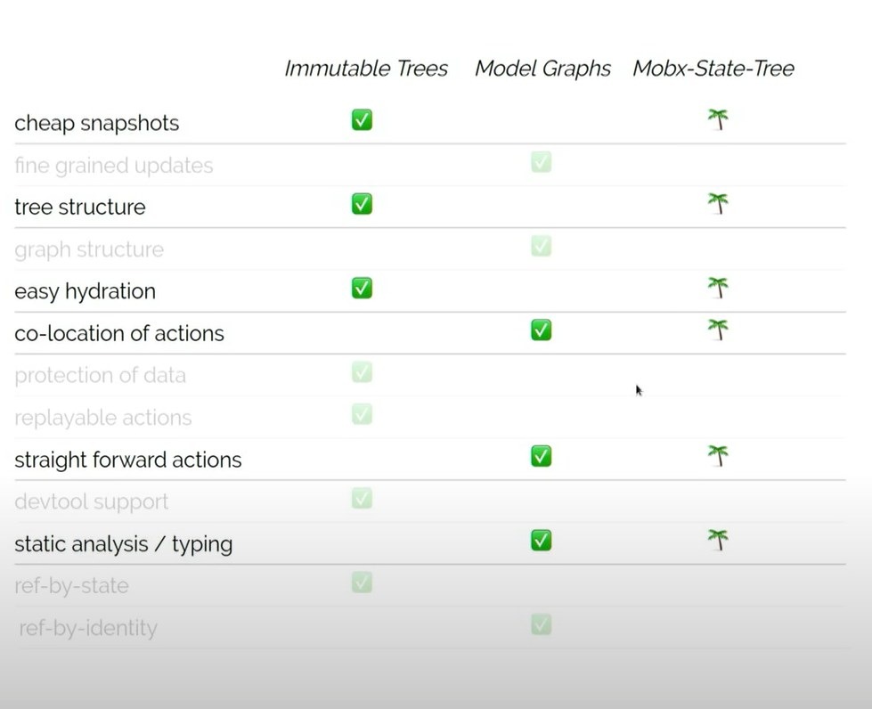
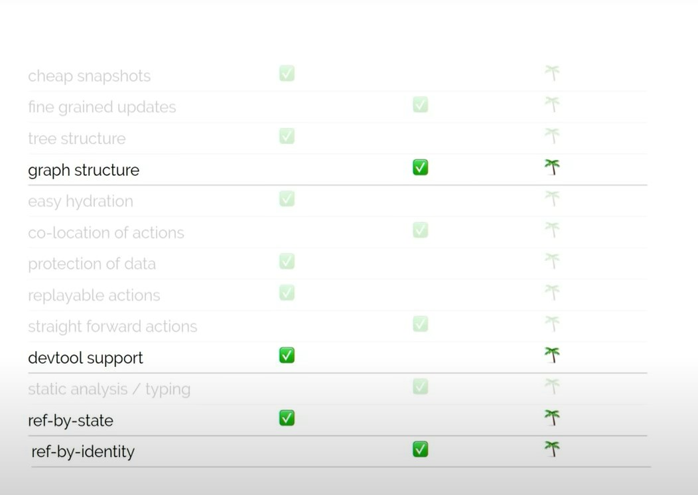

# Mobx State Tree

[mobxjs/mobx-state-tree](https://github.com/mobxjs/mobx-state-tree)

> Mobx-State-Tree is an opinionated library that imposes a strict architecture on state organization.

> State is stored in an immutable, structurally shared tree.

> Business logic removed from the UI (views are passive)
> Provides a structure for communication  
> Embrace composition and reactivity  
> Relay on the computed properties not on the model
> Subscribe to all the path streams (patches)
> Replay and record snapshots, patches and actions
> Protection against uncoordinated modifications
> Protection against stale reads
> Runtime type checking and inferred TypeScript static type checks, design time type checking

> A good model makes it easier to deal with reality

> State is not just data but identities and relations

Mobx is like a spreadsheet  
Observables - spreadsheet's data cells that have values  
Actions - the act of changing the values of spreadsheet's data cells  
Computed Value - formulas and charts that can be derived from the data cells and other formulas  
Reaction - drawing the output of a data cell or a formula

`observer` - turn components into reactive components
`inject` - connects components to provided stores

## Tree

A node can exist only once in a Tree
Any node in a Tree is a Tree itself
All leaves in the Tree must be serializable
Every change to a model correspond to a snapshot and a patch

Tree consists of 2 thing:

- state (contents)
- shape (type)

```js
const Type = types.model(properties, actions);
const instance = Type.create(snapshot);
instance.someAction();

const snapshot = getSnapshot(instance);
```

```js
const Book = types.model(
  {
    title: types.string,
    price: types.number,
  },
  {
    setPrice(newPrice) {
      this.price = newPrice;
    },
  }
);

const Store = types.model({
  books: types.array(Book),
});

const store = Store.create({
  books: [
    {
      title: "Some Title",
      price: 29.99,
    },
  ],
});

store.books[0].setPrice(99.99);

//composing types
store.books.push(Book.create({ title: "Some Title" }));
store.books.push({ title: "Some Title" });

//references

const cartEntry = types.model({
  amount: types.number,
  book: types.reference(Book), //it's not a Book, it's just a reference
});

cartEntry.book = bookStore.books[0]; //normalization done behind the scenes  and reference management
```





## Stores

One root store - can preform actions on everything at once, DI is shared

Multiple root stores - easier to reason by Domain (isolation), can't easily preform actions on everything, DI isn't shared

### Store Communication

> Each Store access directly other Stores `getParent(self).someStore` - each store knows the whole structure
> Actions wrapper - calls directly other Stores, knows the whole structure
> Dependency Injection - injecting stores into one another, can be used for both Actions and Views

```js
const firstStore = FirstStore.Create({});
const secondStore = SecondStore.Create({ someProperty: "Foo" }, { firstStore });
```

### Store Composition

> When data is the same but the behavior is different

`const thirdStore = types.compose(FirstStore, SecondStore);`

- separation of concerns
- reusability

# Actions

> instances can only be modified through actions  
> actions can only modify own subtree

```js
store.books[0].price = 99.99; //Error cannot modify the object is protected
```

> Method invocation produces action description

```js
//MST is fully recursive concept, every node in the tree is state tree in it self and any operation in the tree can be invoked on a node
const bookCopy = clone(store.books[0]);
const recorded = recordActions(bookCopy);

recorder.replay(store.books[0]); //atomic commit of all the changes the user made
```

# Environment

```js
import { getEnv } from "mobx-state-tree";
```

## Talks

### Next generation state management - Michel Weststrate aka @mweststrate at @ReactEurope 2017

[](https://www.youtube.com/watch?v=rwqwwn_46kA)

### You don’t know MobX State Tree | Max Gallo | iJS London 2018

[](https://www.youtube.com/watch?v=LKyCJB27oNM)

### Introduction to MobX State Tree

[](https://www.youtube.com/watch?v=pPgOrecfcg4)

### Combining GraphQL + mobx-state-tree - Michel Weststrate (@mweststrate) @ReactEurope 2019

[](https://www.youtube.com/watch?v=Sq2M00vghqY)

### MobX State Tree React pure reactivity served - Luca Mezzalira

[](https://www.youtube.com/watch?v=HS9revHrNRI)

### Chain React 2019 - Devlin Duldulao - Getting Started with Mobx Statetree

[](https://www.youtube.com/watch?v=jD6iCt-Qz5k)

### MobX - Statement Management with no Boilerplate - React Native London - March 2020

[](https://www.youtube.com/watch?v=3Gt-Cxjld3g)

### MobX, or: Going from Mutable to Immutable to Reactive State Management - Michel Weststrate - CityJS

[](https://www.youtube.com/watch?v=ZHxFrbK3VB0)

### Michel Weststrate: MobX: The Quest For Immer Mutable State Management

[](https://www.youtube.com/watch?v=ta8QKmNRXZM)

# Courses

[Manage Application State with Mobx-state-tree](https://egghead.io/courses/manage-application-state-with-mobx-state-tree)

[Manage Complex State in React Apps with MobX](https://egghead.io/courses/manage-complex-state-in-react-apps-with-mobx)

[Immutable JavaScript Data Structures with Immer](https://egghead.io/courses/immutable-javascript-data-structures-with-immer)

_How do I work with state in React?_  
[](https://www.youtube.com/watch?v=x-ioxWvuZMg)

_What is MobX-State-Tree and how can it help me with React?_  
[](https://www.youtube.com/watch?v=eQGwNIYXELI)

_How do I get started with MobX-State-Tree and React?_  
[](https://www.youtube.com/watch?v=Dxhd5uawayk)

_How do I modify state values in React with MobX-State-Tree?_  
[](https://www.youtube.com/watch?v=FdhWx18qm5g)

_How do I create views with MobX-State-Tree?_  
[](https://www.youtube.com/watch?v=sC3rbp6iBbQ)

# Blogs

[The Curious Case of Mobx State Tree](https://codeburst.io/the-curious-case-of-mobx-state-tree-7b4e22d461f)

[Why Infinite Red uses MobX-State-Tree instead of Redux](https://shift.infinite.red/why-infinite-red-uses-mobx-state-tree-instead-of-redux-d6c1407dead)

[Understanding MobX and MobX State Tree](https://medium.com/game-development-stuff/understanding-mobx-and-mobx-state-tree-7bd37f734789)

[State Management with MobX State Tree](https://medium.com/react-native-training/state-management-with-mobx-state-tree-373f9f2dc68a)

# mst-gql

[https://github.com/mobxjs/mst-gql](mst-gql)

> Bindings for mobx-state-tree and GraphQL
> Run scaffolding in your CI/CD against production endpoint to verify readiness

```bash
yarn mst-gql --format ts http://localhost:4000/graphql
```

[](https://www.youtube.com/watch?v=Sq2M00vghqY)
