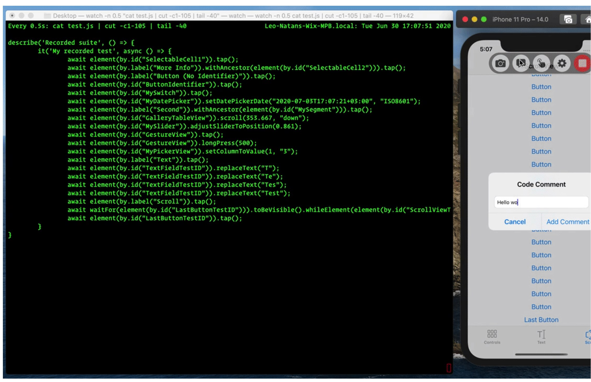

# Detox

> Detox is built from the ground up for native mobile and has deep first-class support for React Native apps.

> Designed most specifically for React Native, speed and stability, knows when the app is idle (special support for React Native idle synchronization)

> Detox only supports running tests on iOS simulators. Physical iOS devices are not supported ([Ref-1](https://github.com/wix/Detox/issues/95) [Ref-2](https://github.com/wix/Detox/pull/2198))

[](https://www.youtube.com/watch?v=4rU0IGEt6OQ)

```js
beforeEach(async () => {
  await device.launchApp({ newInstance: true });
});

it("First test", async () => {
  await element(by.id("screen1")).tap();
  await expect(element(by.id("itemInScreen1"))).toBeVisible();
});

it("Second test", async () => {
  await element(by.id("screen2")).tap();
  await expect(element(by.id("itemInScreen2"))).not.toBeVisible();
});
```

> restart the app before every test, and don’t worry about cleaning up or getting to a specific state at every test’s ending. As a rule of thumb, end every test with an expect line.

[Detox Docs](https://github.com/wix/Detox/tree/master/docs)

[Detox Principles](https://github.com/wix/Detox/blob/master/docs/Introduction.DesignPrinciples.md)

_Detox Pros_

- made by Wix for React Native
- Detox is way faster than Appium or any other third-party tool as it syncs with the app (gray box testing - connection between tests and internal processes)

> Gray box drivers are developed by Google — EarlGrey for iOS and Espresso for Android.

- works in sync with the app. Not so flaky.
- integrated easily in any React Native app.
- The initial cost and efforts are much less than any other tools.
- parallel test execution on both iOS and Android [Run multiple instances of a single AVD concurrently](https://developer.android.com/studio/releases/emulator#concurrent-avd)

- supports WebViews on Android [18.7.0](https://github.com/wix/Detox/releases/tag/18.7.0)

_Detox Cons_

- No Real Testing for iOS (can't currently use AWS Device Farm)

## Screenshots

[Taking Screenshots](https://github.com/wix/Detox/blob/master/docs/APIRef.Screenshots.md)

- Taking a screenshot, once, and manually verifying it, visually.
- Storing it as an e2e-test asset (i.e. the snapshot).
- Using it as the point-of-reference for comparison against screenshots taken in consequent tests, from that point on.

## Detox Recorder

[Detox Recorder](https://github.com/wix/DetoxRecorder)

> Detox Recorder is a utility for recordings steps for a Detox test as you use your app in Simulator. After recording the test, add expectations that check if interface elements are in the expected state.


[](https://github.com/wix/DetoxRecorder/blob/master/Documentation/Resources/Presentation.gif)

# Detox Perfecto

[Perfecto Detox Integration](https://developers.perfectomobile.com/display/PD/Detox)  
[Perfecto Detox Samle](https://github.com/PerfectoMobileSA/PerfectoDetoxSample)

# Pefecto Quantum

[Quantum Starter Kit](https://github.com/Perfecto-Quantum/Quantum-Starter-Kit)

# React Native testID and accessibility label

[testID](https://reactnative.dev/docs/view#testid)

> Used to locate this view in end-to-end tests.

_This disables the 'layout-only view removal' optimization for this view!_

> it's a view that's declared in JSX but doesn't actually show on screen and doesn't manipulate rendering of other views and thus can be flattened (removed from the native view hierarchy) to improve performance

[Ref](https://stackoverflow.com/a/53509724/1241400)

accessibilityLabel (Android)

```jsx
//so all the elements are findable by Appium
accessible = { false };
```

### Testing React Native Apps with Appium | HeadSpin Webinar

[](https://www.youtube.com/watch?v=Rs_4kyqQlU4)

# Production E2E Tests

> Help QA replace manual testing

Pros

- Real user experience (close as possible)
- Easy to setup
- Easy to write
- High confidence

Cons

- Flaky
- Slow
- Hard to maintain

# Mocked E2E Tests

Pros

- Closer to code (stable environment)
- Easy to maintain

Cons

- Hard to setup
- Hard to write

# Appium vs Detox

Appium

- QA is writing the tests
- Write tests in a language that might not be JavaScript
- Test on real devices (Detox can test on real Android's, not yet on iOS)

Detox

- Engineers are writing the tests
- Speed and idle sychronization
- Tight integration between the React Native workflow and your tests

# Testing Loop

Engineers - unit tests, mocked E2E  
QA - production E2E, scenarios

# Talks

### React Native EU 2019: Vojtech Novak - Real World e2e Testing With Detox

[](https://www.youtube.com/watch?v=_neMz2_6u20)

#### Detox: tackling the flakiness of mobile automation - Viktorija Sujetaitė

[](https://www.youtube.com/watch?v=4rU0IGEt6OQ)

### Testing React Native Apps with Appium | HeadSpin Webinar

[](https://www.youtube.com/watch?v=Rs_4kyqQlU4)

### Detox: Tackling the Flakiness of Mobile Automation by Viktorija Sujetaitė

[](https://www.youtube.com/watch?v=d0ZlKebGGm8)

### Why the h# should I use Appium with ReactNative? - Wim Selles | AppiumConf 2018

[](https://www.youtube.com/watch?v=10Zzlf5DmSI)

### Chain React 2018: Detox: A year in. Building it, Testing with it by Rotem Mizrachi-Meidan

[](https://www.youtube.com/watch?v=aMheT1qL5Lk)

### Detox — Graybox End-to-End Tests and Automation Library for React Native by Tal Kol aka @koltal

[](https://www.youtube.com/watch?v=Ndof_lgJmx8)

### Detox: Graybox End to End Tests and Automation Library for Mobile Apps - Rotem Mizrachi-Meidan

[](https://www.youtube.com/watch?v=qiRJT5Eig3g)

### Rotem Mizrachi-Meidan: Detox — Graybox E2E Tests Library for React Native – ReactNext 2017

[](https://www.youtube.com/watch?v=GgFFeI70PWw)

>

# Blogs

[Testing React Native Apps with Appium](https://www.headspin.io/blog/appium/testing-react-native-apps-with-appium/)

[Detox: Writing Stable Test Suites](https://medium.com/wix-engineering/detox-writing-stable-test-suites-372c9d537184)

[Detox: The Unobtainable Test Stability (or is it?)](https://medium.com/wix-engineering/detox-the-unobtainable-test-stability-or-is-it-5f8cd765df1c)

[End-to-end testing in React Native with Detox](https://blog.logrocket.com/end-to-end-testing-in-react-native-with-detox/)

[Testing mobile apps across hundreds of real devices with Appium, Node.js, and AWS Device Farm](https://aws.amazon.com/blogs/mobile/testing-mobile-apps-across-hundreds-of-real-devices-with-appium-node-js-and-aws-device-farm/)

[Detox vs. Appium: automated UI tests in React Native](https://medium.com/reactive-hub/detox-vs-appium-ui-tests-in-react-native-2d07bf1e244f)

[Detox vs. Appium – a comparison of React Native testing frameworks](https://blog.codecentric.de/en/2020/07/detox-vs-appium-a-comparison-of-react-native-testing-frameworks/)

[Detox and Appium complete comparison](https://github.com/Lumary2/University/blob/master/Detox_Appium_Comparison.pdf)

[Detox: Gray Box End to End Testing Framework for Mobile Apps](https://hackernoon.com/detox-gray-box-end-to-end-testing-framework-for-mobile-apps-196ccd9564ce)

# Deprecated

[Repackager](https://github.com/wix/react-native-repackager)
